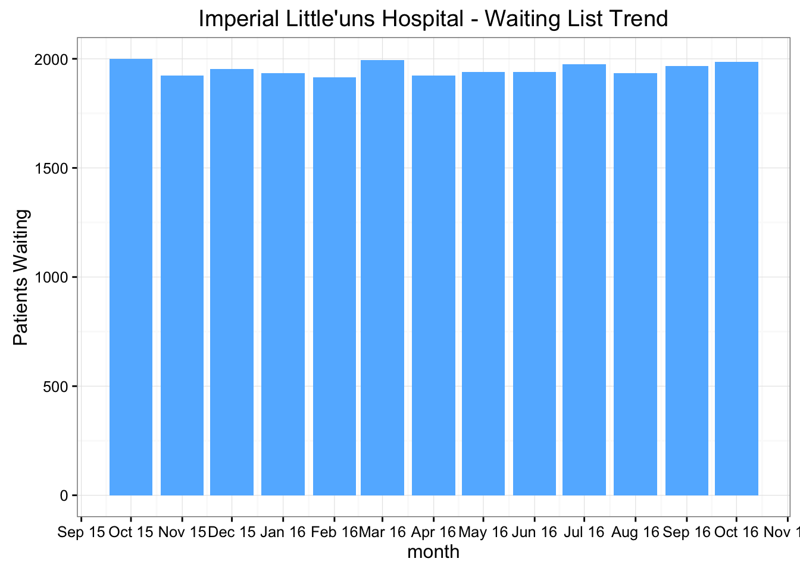
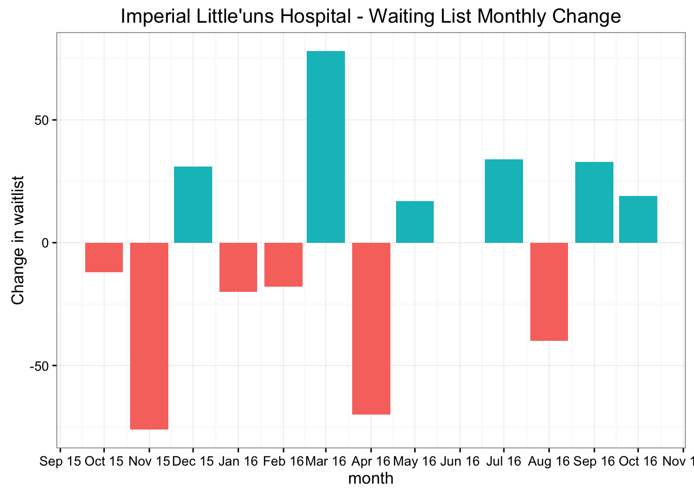
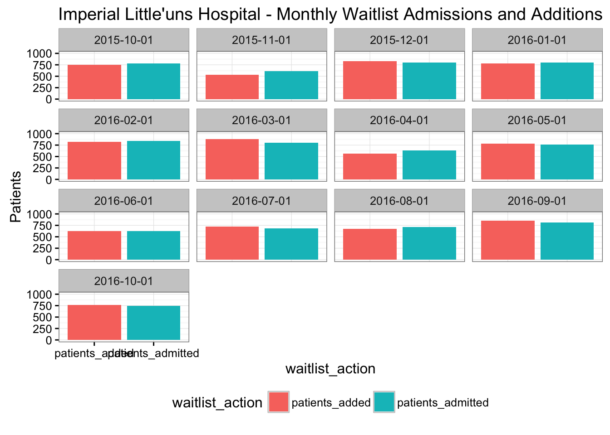
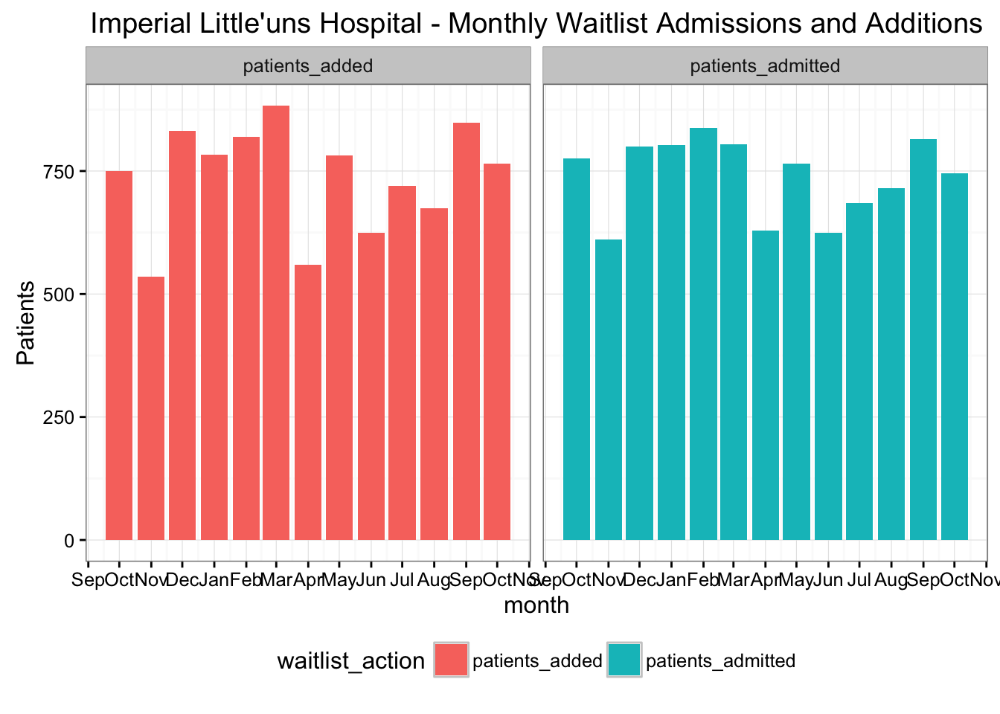

# Rreports!
## An introduction to using R for reporting

Adam Gruer 
Oct 27 2016

Last updated: 2016-10-30 17:45:59

## Overview
This is a short demo on how R can be a very effective
tool for producing reports.  
 
## Operating system and R version 
 Below are the details of the operating system and version of R used to 
 create this report.
 


```r
version
```

```
##                _                           
## platform       x86_64-apple-darwin13.4.0   
## arch           x86_64                      
## os             darwin13.4.0                
## system         x86_64, darwin13.4.0        
## status                                     
## major          3                           
## minor          3.1                         
## year           2016                        
## month          06                          
## day            21                          
## svn rev        70800                       
## language       R                           
## version.string R version 3.3.1 (2016-06-21)
## nickname       Bug in Your Hair
```

## Load packages
As always, the first step is to load all the necessary packages


```r
suppressPackageStartupMessages({
library(tidyverse)
library(lubridate)
})
```

```
## Conflicts with tidy packages ----------------------------------------------
```

## Create some random test data for elective surgery waitlist report


```r
set.seed(198) #100
waitlist <- tibble(
            month = seq.Date(
                            from = ymd("2015 Oct 01"),
                            to = ymd("2016 Oct 01"),
                            by = "month" ),
            patients_waiting = sample(
                                        1900:2000,
                                        size = 13,
                                        replace = TRUE),
            patients_admitted = sample(
                              600:900,
                              size = 13,
                              replace = TRUE)
            
            
            )
```

Let's use the dplyr package to work out the patients added each month using 
the difference between the month and the previous month , **add back** the admissions
in the month.  We add this to out data table.


```r
waitlist <- waitlist %>%
  mutate( patients_waiting_change =
            patients_waiting - lag(patients_waiting) ) %>%
  mutate( patients_added = 
            patients_waiting_change + patients_admitted) %>%
  replace_na(list(patients_added = 750L, patients_waiting_change = -12L))
```


We will create some variables for the hospital name and city so we don't have to
type it everywhere - and when we get a new job we can bring this report with us


```r
hospital_name <-  "Imperial Little'uns Hospital"
hospital_city <-  "North Haverbrook"
```


## Imperial Little'uns Hospital, North Haverbrook
### Waitlist Report


month         patients_waiting   patients_admitted   patients_waiting_change   patients_added
-----------  -----------------  ------------------  ------------------------  ---------------
2016-10-01                1987                 746                        19              765
2016-09-01                1968                 815                        33              848
2016-08-01                1935                 715                       -40              675
2016-07-01                1975                 685                        34              719
2016-06-01                1941                 624                         0              624
2016-05-01                1941                 765                        17              782
2016-04-01                1924                 629                       -70              559
2016-03-01                1994                 805                        78              883
2016-02-01                1916                 837                       -18              819
2016-01-01                1934                 803                       -20              783
2015-12-01                1954                 800                        31              831
2015-11-01                1923                 611                       -76              535
2015-10-01                1999                 776                       -12              750

### Waitlist Trend




In October, the waiting list for elective surgery increased by 19 (1.0%) to 1987. There were 746 admissions from the waiting list and 765 children were added to the waiting list during the month.



### Monthly Admissions and Additions




---
title: "ESIS_report.R"
author: "Adam"
date: "Sun Oct 30 17:45:59 2016"
---
